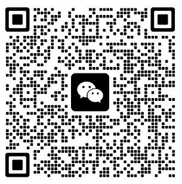
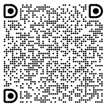

<p align="center">
  <a href="https://github.com/hyqibot/DeepSeek-Harness-Token-Free"></a>
  
  <a href="LICENSE"></a>
  <a href="https://discord.gg/TJeGqKRNM"></a>
  
</p>

<p align="center"><sub><a href="README.md">中文</a> · English</sub></p>

<h3 align="center">A token-free desktop client for the DeepSeek Harness (DSH) ecosystem</h3>

<a id="run"></a>

<!-- bump these 3 URLs on each desktop release (filenames include the version) -->
<p align="center">
  <a href="https://github.com/hyqibot/DeepSeek-Harness-Token-Free/releases/download/v2.2.5/DSH-Desktop-2.2.5-x64-Setup.exe"></a>
  &nbsp;
  <a href="https://github.com/hyqibot/DeepSeek-Harness-Token-Free/releases/download/v2.2.5/DSH-Desktop-2.2.5-arm64.dmg"></a>
  &nbsp;
  <a href="https://github.com/hyqibot/DeepSeek-Harness-Token-Free/releases/download/v2.2.5/DSH-Desktop-2.2.5-x64.dmg"></a>
</p>
<p align="center"><sub>Current v2.2.5 · <a href="https://github.com/hyqibot/DeepSeek-Harness-Token-Free/releases/latest">All releases</a> · macOS is unsigned/unnotarized — right-click Open</sub></p>

<p align="center">
  
</p>

> **Public repository notice**: Download desktop builds from [Releases](https://github.com/hyqibot/DeepSeek-Harness-Token-Free/releases). **Zero-Token (free-token) mode requires the Release installer** — it ships the private gateway; you cannot build the full Zero-Token stack from this public source tree.

## Features

<table>
  <tr>
    <td width="50%" valign="top">
      <h3>Desktop</h3>
      <p>Bring the official DeepSeek Harness local Web UI to a native desktop application. The app starts and manages the local Harness service, integrates the system tray and desktop window, and requires no Node.js installation or command-line setup.</p>
    </td>
    <td width="50%" valign="top">
      <h3>Mobile Remote Control</h3>
      <p>Telegram, Discord, Feishu, WeChat, and a LAN PWA share one pairing code. Send tasks from a phone bot or add the PWA to the home screen. The Web UI stays on 127.0.0.1.</p>
    </td>
  </tr>
  <tr>
    <td width="50%" valign="top">
      <h3>Plugin Marketplace</h3>
      <p>The tray Marketplace installs catalog plugins through official <code>dsh plugin add</code>. Unaudited dshmarket is not bundled. Service management, system integration, and the marketplace are Cordis Host rows composed with the profile.</p>
    </td>
    <td width="50%" valign="top">
      <h3>Channels</h3>
      <p>Paired IM identities remote-control the in-process Agent. The token-free gateway also listens on localhost in the same process: official API keys need no activation code; optional token-free web models that avoid token fees share the same activation code as the built-in <strong>HYQi</strong> chat model (community quota, no extra key).</p>
    </td>
  </tr>
</table>

## Plugin Ecosystem

DeepSeek Harness is built on [Cordis](https://github.com/cordiverse/cordis) and follows an “everything is a plugin” architecture. Core capabilities such as model adapters, the tool registry, the session log, and the Agent Loop participate in the runtime as plugins, so they can be composed or replaced through configuration. External plugins can also join a runtime through profiles and bundles. See the official [architecture overview](https://github.com/deepseek-ai/deepseek-harness/blob/master/docs/architecture.md) and [plugin management documentation](https://github.com/deepseek-ai/deepseek-harness/blob/master/apps/cli/reference/README.md#plugin-management).

Desktop is already composed as official Cordis plugins: the window and tray (`desktop-shell`), services and pnpm (`desktop-pnpm` / `desktop-profiles`), system integration (`desktop-terminal` / `desktop-updates`), IM remote control (`desktop-channels`), the LAN phone shell (`desktop-mobile`), the token-free gateway (`desktop-zero-token`), the HYQi community model (`desktop-hyqi`), the marketplace (`desktop-marketplace`), and plugin switches (`desktop-plugin-toggles`) all mount as Host rows and follow the same `dsh plugin add` composition model.


## Statement

This project is built on [deepseek-ai/deepseek-harness](https://github.com/deepseek-ai/deepseek-harness).

It is an implementation based on DeepSeek Harness and the Cordis plugin model. The goal is a DeepSeek Harness desktop that is easy to get started with, plus an optional token-free path to major models, so more people can try AI apps without a high cost.

<a id="run-from-source"></a>

## Community

Choose whichever platform you prefer to discuss usage, plugin development, and project updates.

<table>
  <thead>
    <tr>
      <th align="center">WeChat Group</th>
      <th align="center">DingTalk Group</th>
    </tr>
  </thead>
  <tbody>
    <tr>
      <td align="center"></td>
      <td align="center"></td>
    </tr>
  </tbody>
</table>

## Run from source

This public tree can run the **desktop app** (`yarn dev`) with **official / API-key models**.

> **Limit**: The Zero-Token gateway sources and sidecars are **not** in this repository. Use the [Release installer](https://github.com/hyqibot/DeepSeek-Harness-Token-Free/releases) for free-token web mode.

**Requirements**

- Node.js 22.19+ or 24+ (with Corepack)
- [Git](https://git-scm.com)

**1. Clone and install**

```bash
git clone --recurse-submodules https://github.com/hyqibot/DeepSeek-Harness-Token-Free.git
cd DeepSeek-Harness-Token-Free
corepack enable
yarn install
```

**2. Start the desktop app**

```bash
yarn dev
```

Configure an official API key in Settings. Web Zero-Token **only works in the Release installer**.

**Notes**

- This tree does **not** include `dsh-plugin-desktop/vendor/copaw-zero-token/python/`. Local `yarn dist:win` / `yarn dist:mac` will **not** produce a Zero-Token installer.

## License

This project is licensed under the [MIT License](LICENSE).

The DeepSeek web PoW solver is a port of [openclaw-zero-token](https://github.com/linuxhsj/openclaw-zero-token) (Copyright (c) 2025 Peter Steinberger), licensed under MIT. The original copyright notice and permission notice are in [`dsh-plugin-desktop/vendor/copaw-zero-token/LICENSE-openclaw-zero-token.txt`](dsh-plugin-desktop/vendor/copaw-zero-token/LICENSE-openclaw-zero-token.txt). That third-party MIT notice is independent of the DeepSeek copyright above. It is also shown on the token-free settings page.

> This is a community desktop edition built on DeepSeek Harness. It is not an official DeepSeek product.
